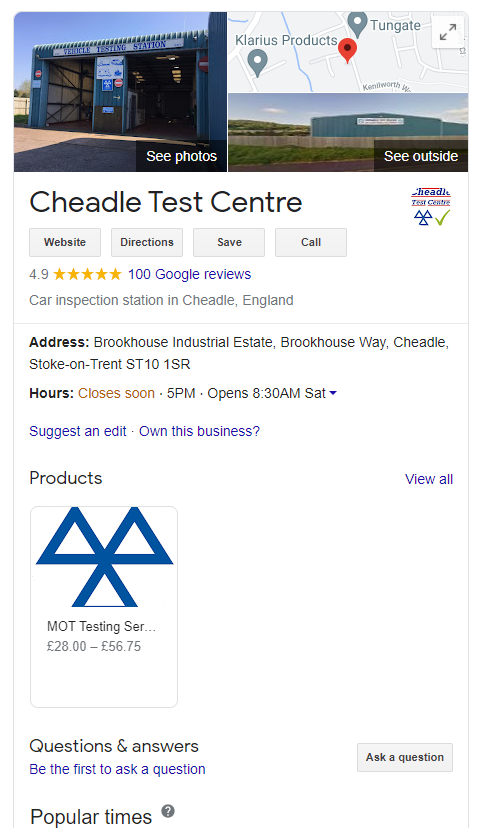

The first thing people do when they search for a local business is Google it. It’s been found that 97% of people learn more about a local company online than anywhere else. (Source: <a href="https://seotribunal.com/blog/stats-to-understand-seo/#local-seo-facts" target="_blank">SEO Tribunal</a>).

If the public can't find you by the methods they are using, as a garage owner, you are going to lose out. So where do you start?

Start by seeing if your garage shows up for a local search term, such as "MOT garage Stoke-on-Trent".

If you're not showing up, then you need to review your website, or if you don't have one, then it's time to get one. Stop missing out on gaining new customers and <Link to="/#contact">contact us</Link>.

You will also notice that at the top of Google for the search term "MOT test Stoke", there are ads. Businesses get their ads to show up for specific search terms, then when someone clicks on their ad, they pay Google for the click - e.g. 15p per click.

Running ads on Google for your website can be a fantastic way to get more traffic to your website, and get the customer to take a specific action – such as book an MOT online. Running ads on Google is one of the methods that falls under the umbrella of “digital marketing”. <Link to="/#contact">Contact us</Link> to find out how we can use digital marketing to help your business.

The great thing about this is that it requires no extra effort from you: your website and ads do the work for you!

At the end of the day, businesses don’t have websites just to make themselves look pretty. They are there to serve a purpose: to drive people to your shop, salon, stall, garage… etc. And make you more money.

Here are six ways that having a good, functional website benefits your business…

## 1. The internet is the customer’s starting point

Today, anyone needing an MOT, service or vehicle repair will begin their search online. Nobody is going to dig up the Yellow Pages or check the local newspaper when they have a smartphone at their fingertips. If you don't have a website, then your ability to get new business is going to be more limited.

Yes, you can always register with an online directory, like Yell, but these provide only your contact details and opening hours. What most people want from these directories is a link to your website. They want to see that your business looks legit, the kind of services you offer and the prices you charge.

A professional website assumes a professional business. Without this, that potential client will often go elsewhere.

## 2. A website is a service

People will continue coming to your garage if you do a great service. But nowadays, that service goes beyond the garage itself; the modern customer wants convenience and speed in the way they deal with your business. They don’t want to have to ring you up or dig around to find out what you do.

The customer is likely looking at multiple garages at a time, and if they can’t find out what you do easily, they’re often going to go elsewhere.

But it’s not just getting information, such as the services you offer, you opening hours and contact details that they want; today, people want to book MOTs and repairs online and pay for it then and there.

They also want to be sent automated reminders when their next MOT is due; For example, they could be sent a text message a few days before it’s due with a link to your online booking page, making it easy for them to come back to your garage and preventing them from looking elsewhere.

Increasingly, customers want fixed prices and to pay for things in advance. Although this can’t be done with things that have to be investigated first, such as some repairs, but there are many occasions when it can, such as fitting a new tyre, replacing a bulb, or with MOTs and services.

Is it worth investing in a website? There are three good reasons why having a website is worthwhile:

1. Providing online services that customers want will attract new business.
2. By letting your website take care of bookings, sales and payments, you’ll save hours of time which can then be spent on more productive tasks.
3. Customers are willing to pay more for a great customer service. A great website provides that, and prevents you from having to compete with your competitors on price alone.

## 3. Get more customers by building a great reputation

Customers are increasingly seeking recommendations from others before selecting which business to go with. They will check out your social media, Google business page, and other listing websites for reviews. They will also check for testimonials on your website.

Having lots of positive reviews will obviously get you more customers, and having bad ones will drive customers away. But having no reviews leaves customers in the dark. Some will not use you due to the lack of reviews. Others will go elsewhere as they find a business that doesn’t ask for reviews suspicious.

Once you have a website, you can set up an account with Google My Business. You could then send out automated text messages or emails after a customer has used your service, asking for a review. This will help to build your reputation as the garage to go to – provided you do a good job!

You can then display those Google reviews on your website. Social proof helps people that have never used your garage before to see that others have had a positive experience with you, and persuades them that going with you is a good choice.

## 4. Be found by more customers

Above we mentioned the benefits of having getting reviews after creating a free Google My Business account. But there are more benefits. Having a Google My Business account automatically puts you in the Google business directory. This makes it more likely that your business will appear in the search results when customers make local searches for garages – such as “MOT test Manchester” or “repair garage near me”.

Also, having online customer reviews sends a strong signal to search engines that communicates expertise, authority, and trust. This further increases your chances of showing up in the search results.

Another advantage of having a Google My Business account is that if someone directly searches for your business, such as “Cheadle mot test centre”, then your business details, images, opening hours, and reviews will be displayed on the right of the search results. And if you have a website that can take bookings, you can list a link under the products section to your bookings page, just like Cheadle Test Centre do.

## 5. Show-off your expertise, professionalism and services

One of the key advantages of a website is that you can promote your services. Not only can you provide written information, but you can upload images showcasing the quality of your work, and your specialist equipment.

You can also provide blog posts or videos that could help your customers solve problems with their cars to help you build an audience of followers to help you grow your business even more.

## 6. 24/7 garage

While most garages are open 8am - 5pm, five or six days per week, vehicle owners will want to get your info and get in touch every day, around the clock. This means that many of your incoming calls will go through to answer machine. By the time you get back to these calls, the customer will have often gone somewhere else.

A website makes your information available 24/7. This is great for your customers, and great for you as you won't have to spend as much time answering questions that could've been looked up on a website. Also, if you offer online booking services, customers can book their vehicle in for an MOT even when you're closed or busy. And more, it gives your customers a way to get in touch no matter the time of day, whether that be by contact form, email, or SMS.

## Conclusion

As you can see, having a good website makes it easier for people to find you, builds your reputation so first-time customers will be more likely to trust you, and does a lot of marketing and sales work for you so that you can spend more time under the bonnet – increasing your garages revenue.

Feel free to <Link to="#contact">contact us</Link> to discuss how we can best help your business. Don't be shy!
